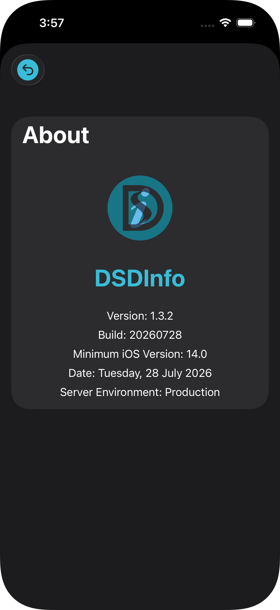

# DSDInfo2
DSD Info 2 (Revamp Project) replacing the legacy DSD Info, Drainage Services Department  
  
This application was developed by K.C. Chan, Joe, CSA5/CS, dated September 27, 2022, built for iOS Version 14.0 or above.
  
# Version History
  
| Version | Build | Minimum Deployments | Modified By | Modified At | Remarks |
|---|---|---|---|---|---|
| 1.0.0 | 20220927 | iOS 14.0 | K.C. Chan, Joe, CSA5/CS | September 27, 2022 | First Release for DSD Info Revamp |
| 1.0.0(a) | 20230929 | iOS 14.0 | K.C. Chan, Joe, CSA5/CS | September 29, 2023 | Proof-of-concepts for Reverse Proxy Migration |
| 1.0.1 | 20230929 | iOS 14.0 | K.C. Chan, Joe, CSA5/CS | September 29, 2023 | Revert | 
| 1.0.2 | 20231113 | iOS 14.0 | K.C. Chan, Joe, CSA5/CS | November 13, 2023 | Merging TU and QA into QATU.  Built ipa for Distribution |
| 1.0.2 | 20231213 | iOS 14.0 | K.C. Chan, Joe, CSA5/CS | December 13, 2023 | Resurrection to the latest version |
| 1.0.3 | 20231213 | iOS 14.0 | K.C. Chan, Joe, CSA5/CS | December 13, 2023 | Updated BCM |
| 1.0.4 | 20240725 | iOS 14.0 | K.C. Chan, Joe, CSSA7/CS | July 23, 2024 | App icons for iOS 18 |
| 1.0.5 | 20240912 | iOS 14.0 | K.C. Chan, Joe, CSSA7/CS | September 12, 2025 | Remove of Special Duty Division |
| 1.1.0 | 20250610 | iOS 14.0 | K.C. Chan, Joe, CSSA7/CS | June 10, 2025 | Updated Provisioning Profile, Rename DSDInfo2 as DSDInfo |
| 1.1.2 | 20260612 | iOS 14.0 | K.C. Chan, Joe, CSSA7/CS | June 12, 2026 | Renewed Distribution Certificate and Provisioning Profile |
| 1.3.0 | 20260130 | iOS 14.0 | K.C. Chan, Joe, CSSA7/CS | January 30, 2026 |  SharePoint Subscription Edition (SPSE), Liquid Glass GUI, Mutual Authentication, Contrast Control |
| 1.3.2 | 20260728 | iOS 14.0 | K.C. Chan, Joe, CSSA7/CS | July 28, 2026 | Provisioning Profile Updated |
| 1.3.2 | 20260729 | iOS 14.0 | K.C. Chan, Joe, CSSA7/CS | July 29, 2026 | Updated Colors |
|   |   |   |   |   |   |

# About Screen




# Provisioning Profiles

## Local File System

You might need to remove outdated provisioning profiles manually.

``` bash
cd ~/Library/Developer/Xcode/UserData/Provisioning\ Profiles
rm *
```

## Check Expiration Date for Provisioning Profile

``` bash
unzip -p DSDInfo.ipa "Payload/*.app/embedded.mobileprovision" | security cms -D | grep -A 1 "ExpirationDate"
```
